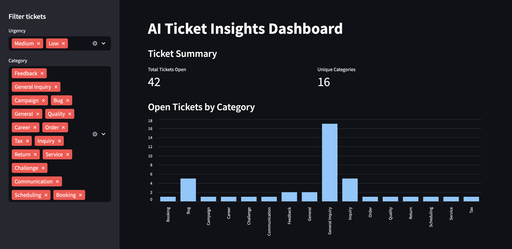
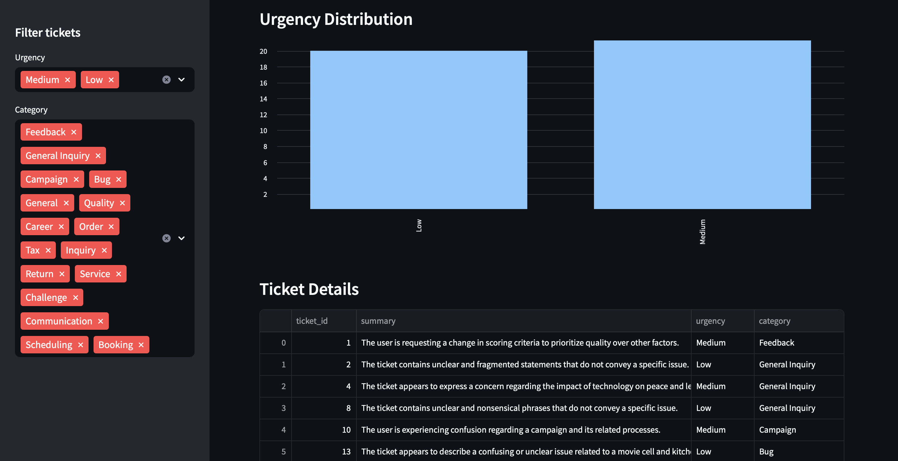
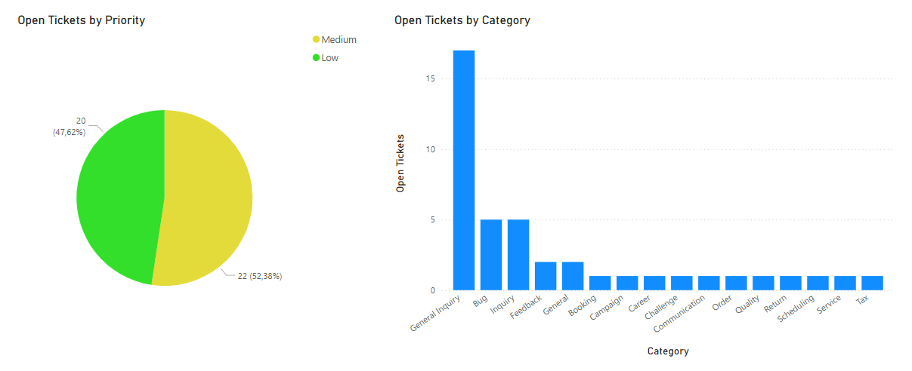
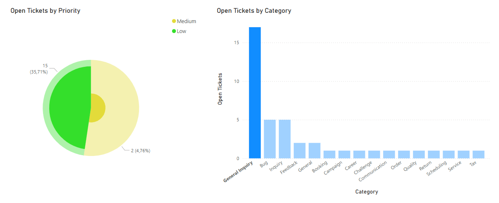

# ai-ticket-insights
A simple ticket analysis tool that uses AWS S3 for data storage, Python and SQL for processing, and GPT for generating summaries. It takes raw support tickets, cleans and enriches them with AI-driven insights, and stores the results in a SQLite database for later exploration.

This project demonstrates how AI can help you make sense of support requests—summarizing key issues, tagging urgency levels, and uncovering trends over time. It pairs a lightweight ETL pipeline with interactive dashboards built in Streamlit (plus an optional Power BI view) so you can explore your enriched ticket data with ease.

It includes:
- A random ticket generator using Faker to simulate support requests
- A simple ETL pipeline that loads and structures data into a SQLite database
- Integration with OpenAI to generate concise summaries, urgency levels, and categories
- AWS S3 integration for storing and retrieving data files (CSV and .db)
- Interactive dashboards for exploring the data, built with Streamlit and Power BI

```text
ai-ticket-insights/
├── scripts/
│   └── run_dashboard.sh                     # Launch helper for Streamlit
├── src/
│   └── ticket_insights/
│       ├── aws/
│       │   └── s3_client.py                 # S3 helpers
│       ├── utils/
│       │   └── logger.py                    # Logging setup
│       ├── data/
│       │   ├── generate_fake_tickets.py     # Creates fake support tickets
│       │   └── tickets.csv                  # Raw input data
│       ├── db/
│       │   ├── init_db.py                   # Sets up database from the input data
│       │   └── tickets.db                   # SQLite database (raw + enriched data)
│       ├── etl/
│       │   └── process_tickets.py           # Enrichment pipeline using GPT
│       ├── output/
│       │   └── enriched_tickets.csv         # Final structured output for BI
│       └── viz/
│           ├── dashboard.py                 # Streamlit dashboard app
│           └── screenshots/                 # Dashboard preview images
├── tests/
│   └── .gitkeep                             # Placeholder for tests
├── README.md
├── .gitignore
└── .env                                     # (Ignored) Env vars, API keys, etc.
```

## Dashboard Previews

<h3>Streamlit View</h3>



<h3>Power BI View</h3>


