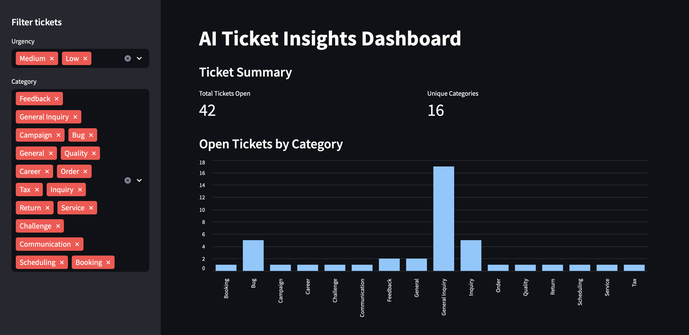
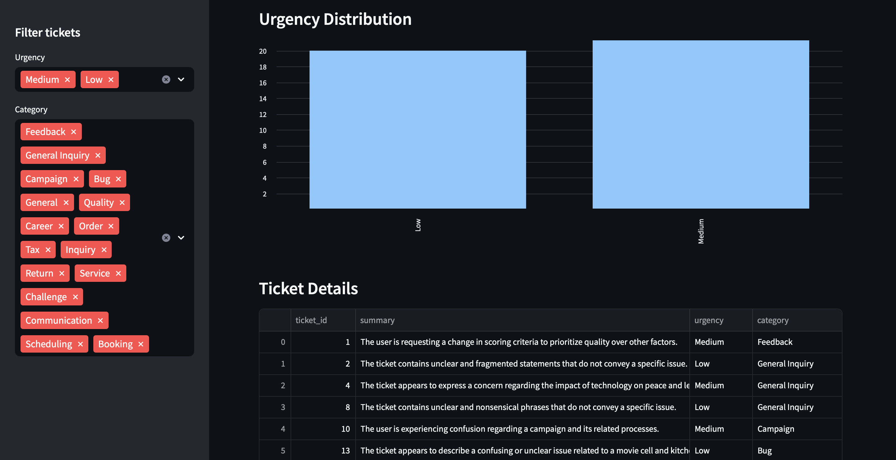
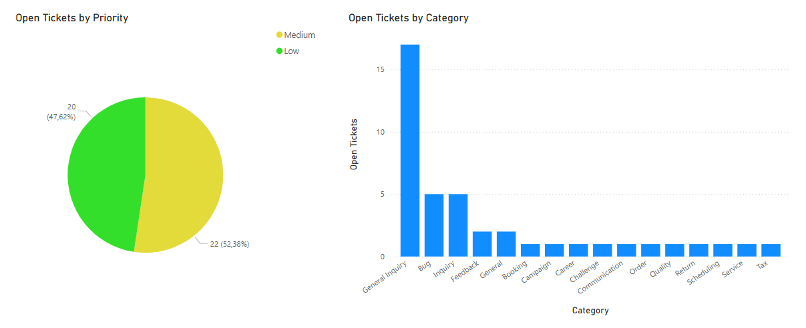
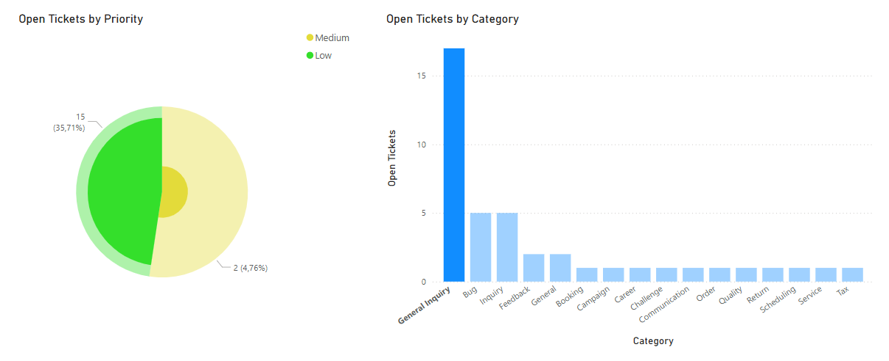

# ai-ticket-insights
AI-powered ticket analysis demo using Python, SQL, and GPT. Processes support data end-to-end: cleans it, summarizes issues using LLMs, and visualizes trends through interactive dashboards built with Streamlit and Power BI.

The idea is to show how AI can help make sense of support tickets by summarizing issues, tagging urgency, and pulling out trends. It's a lightweight project that combines basic data processing, LLM integration, and simple visual reporting.

It includes:
- A random ticket generator using Faker to simulate support requests
- A simple ETL pipeline that loads and structures data into a SQLite database
- Integration with OpenAI to generate concise summaries, urgency levels, and categories
- Interactive dashboards for exploring the data, built with Streamlit and Power BI

```text
ai-ticket-insights/
├── data/
│   ├── generate_fake_tickets.py      # Creates fake support tickets
│   └── tickets.csv                   # Raw input data
├── db/
│   ├── init_db.py                    # Sets up database from the input data
│   └── tickets.db                    # SQLite database (raw + enriched data)
├── etl/
│   └── process_tickets.py            # Enrichment pipeline using GPT
├── output/
│   └── enriched_tickets.csv          # Final structured output for BI
├── viz/
│   ├── dashboard.py                  # Streamlit dashboard app
│   └── screenshots/                  # Dashboard preview images
├── README.md
├── .gitignore
└── .env                              # (ignored) OpenAI API key
```

## Dashboard Previews

<h3>Streamlit View</h3>



<h3>Power BI View</h3>


